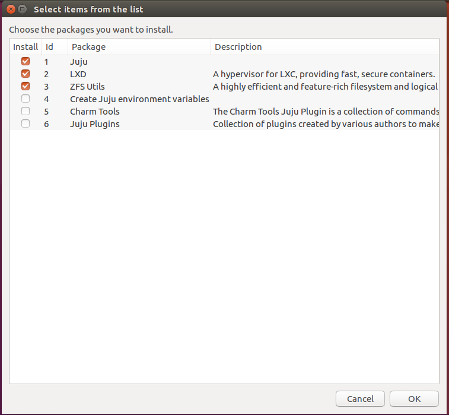

# [Juju](https://jujucharms.com/) Setup

> Simple script for installing Juju tools on Ubuntu environment

## Preview:



## Installation

1. Clone this repository:

    ```sh
    git clone git@github.com:brenopolanski/juju-setup.git
    ```

2. Access the directory and add the execute permission through the command below:

    ```sh
    sudo chmod +x juju-setup.sh
    ```

3. Run the file:

    ```sh
    ./juju-setup.sh
    ```

## Optional installation

Run the command in your terminal:

```sh
sudo sh -c "$(curl -fsSL https://raw.githubusercontent.com/brenopolanski/juju-setup/master/juju-setup.sh)"
```

## Contributing

1. Fork it!
2. Create your feature branch: `git checkout -b my-new-feature`
3. Commit your changes: `git commit -m "Add some feature"`
4. Push to the branch: `git push origin my-new-feature`
5. Submit a pull request  :)

English is the universal language nowadays, so please don't create or comment on issues using another language.

## License

[MIT License](http://brenopolanski.mit-license.org/) © Breno Polanski
